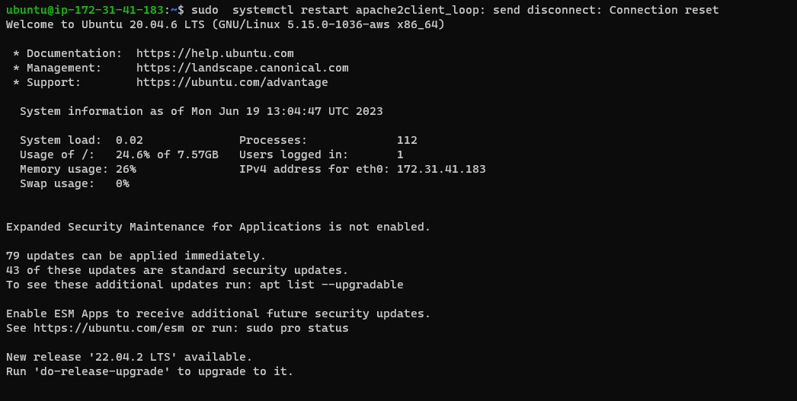
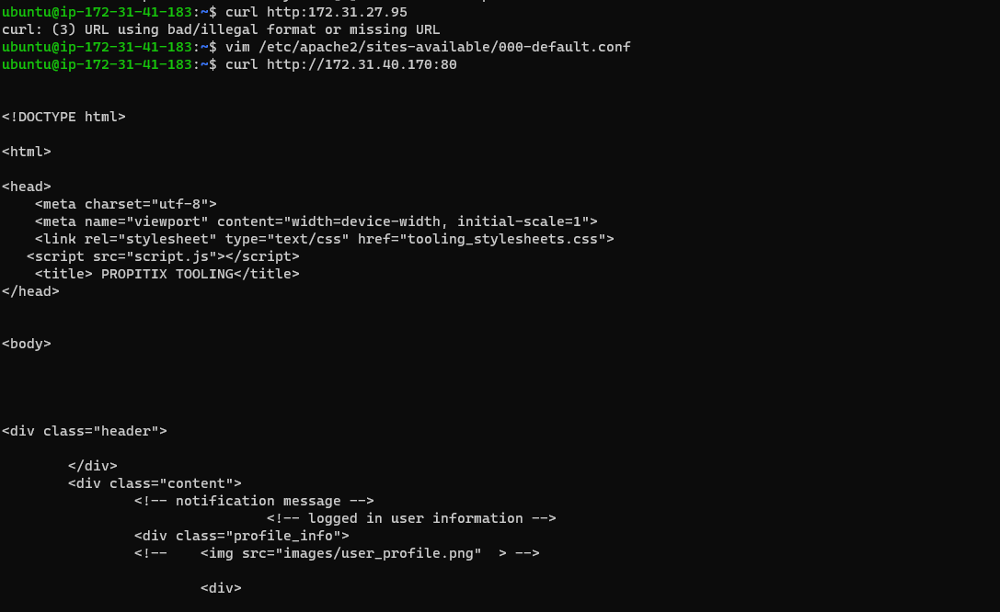

# LOAD BALANCER SOLUTION WITH APACHE

in this project I access a website in the Internet using an URL and I use two RHEL8 web servers,One MySQL DB Server (based on Ubuntu 20.04),One RHEL8 NFS server, I make sure my apache2 is up and running after making sure apache2 is running I configure load balancing after that i verify that my cifiguration works on my browser.

## Result i got while doing project8 

### To install load balancer On apache load server and configure it to point traffic coming to load balancer to both web server 

### Configure Apache As  Load Balancer
Open TCP port 80 on Apache Load Balancer Server.
Install Apache Load Balancer on Apache Load Balancer Server and configure it to point traffic coming to Load Balancer to Both Web Servers equally.

Lastly I opened web browser and try to access the ip adress of the load balancer server after running `sudo tail -f /var/log/httpd/access_log` on the two Web Server as shown below:

